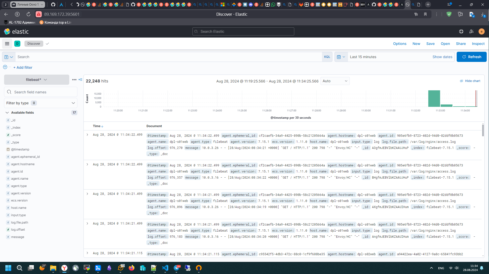

#  Дипломная работа по профессии «Системный администратор»

Содержание
==========
* [Задача](#Задача)
* [Инфраструктура](#Инфраструктура)
    * [Сайт](#Сайт)
    * [Мониторинг](#Мониторинг)
    * [Логи](#Логи)
    * [Сеть](#Сеть)
    * [Резервное копирование](#Резервное-копирование)
    * [Дополнительно](#Дополнительно)
* [Выполнение работы](#Выполнение-работы)
    * [Terraform](#Terraform)
    * [Ansible](#Ansibble)
        * [WEB](#WEB)
        * [ELK](#ELK)
        * [Zabbix](#Zabbix)
* [Ссылки](#Ссылки)
---------

## Задача
Ключевая задача — разработать отказоустойчивую инфраструктуру для сайта, включающую мониторинг, сбор логов и резервное копирование основных данных. Инфраструктура должна размещаться в [Yandex Cloud](https://cloud.yandex.com/) и отвечать минимальным стандартам безопасности: запрещается выкладывать токен от облака в git. Используйте [инструкцию](https://cloud.yandex.ru/docs/tutorials/infrastructure-management/terraform-quickstart#get-credentials).

**Перед началом работы над дипломным заданием изучите [Инструкция по экономии облачных ресурсов](https://github.com/netology-code/devops-materials/blob/master/cloudwork.MD).**

## Инфраструктура
Для развёртки инфраструктуры используйте Terraform и Ansible.

Не используйте для ansible inventory ip-адреса! Вместо этого используйте fqdn имена виртуальных машин в зоне ".ru-central1.internal". Пример: example.ru-central1.internal  - для этого достаточно при создании ВМ указать name=example, hostname=examle !!

Важно: используйте по-возможности **минимальные конфигурации ВМ**:2 ядра 20% Intel ice lake, 2-4Гб памяти, 10hdd, прерываемая.

**Так как прерываемая ВМ проработает не больше 24ч, перед сдачей работы на проверку дипломному руководителю сделайте ваши ВМ постоянно работающими.**

Ознакомьтесь со всеми пунктами из этой секции, не беритесь сразу выполнять задание, не дочитав до конца. Пункты взаимосвязаны и могут влиять друг на друга.

### Сайт
Создайте две ВМ в разных зонах, установите на них сервер nginx, если его там нет. ОС и содержимое ВМ должно быть идентичным, это будут наши веб-сервера.

Используйте набор статичных файлов для сайта. Можно переиспользовать сайт из домашнего задания.

Виртуальные машины не должны обладать внешним Ip-адресом, те находится во внутренней сети. Доступ к ВМ по ssh через бастион-сервер. Доступ к web-порту ВМ через балансировщик yandex cloud.

Настройка балансировщика:

1. Создайте [Target Group](https://cloud.yandex.com/docs/application-load-balancer/concepts/target-group), включите в неё две созданных ВМ.

2. Создайте [Backend Group](https://cloud.yandex.com/docs/application-load-balancer/concepts/backend-group), настройте backends на target group, ранее созданную. Настройте healthcheck на корень (/) и порт 80, протокол HTTP.

3. Создайте [HTTP router](https://cloud.yandex.com/docs/application-load-balancer/concepts/http-router). Путь укажите — /, backend group — созданную ранее.

4. Создайте [Application load balancer](https://cloud.yandex.com/en/docs/application-load-balancer/) для распределения трафика на веб-сервера, созданные ранее. Укажите HTTP router, созданный ранее, задайте listener тип auto, порт 80.

Протестируйте сайт
`curl -v <публичный IP балансера>:80`

### Мониторинг
Создайте ВМ, разверните на ней Zabbix. На каждую ВМ установите Zabbix Agent, настройте агенты на отправление метрик в Zabbix.

Настройте дешборды с отображением метрик, минимальный набор — по принципу USE (Utilization, Saturation, Errors) для CPU, RAM, диски, сеть, http запросов к веб-серверам. Добавьте необходимые tresholds на соответствующие графики.

### Логи
Cоздайте ВМ, разверните на ней Elasticsearch. Установите filebeat в ВМ к веб-серверам, настройте на отправку access.log, error.log nginx в Elasticsearch.

Создайте ВМ, разверните на ней Kibana, сконфигурируйте соединение с Elasticsearch.

### Сеть
Разверните один VPC. Сервера web, Elasticsearch поместите в приватные подсети. Сервера Zabbix, Kibana, application load balancer определите в публичную подсеть.

Настройте [Security Groups](https://cloud.yandex.com/docs/vpc/concepts/security-groups) соответствующих сервисов на входящий трафик только к нужным портам.

Настройте ВМ с публичным адресом, в которой будет открыт только один порт — ssh.  Эта вм будет реализовывать концепцию  [bastion host]( https://cloud.yandex.ru/docs/tutorials/routing/bastion) . Синоним "bastion host" - "Jump host". Подключение  ansible к серверам web и Elasticsearch через данный bastion host можно сделать с помощью  [ProxyCommand](https://docs.ansible.com/ansible/latest/network/user_guide/network_debug_troubleshooting.html#network-delegate-to-vs-proxycommand) . Допускается установка и запуск ansible непосредственно на bastion host.(Этот вариант легче в настройке)

Исходящий доступ в интернет для ВМ внутреннего контура через [NAT-шлюз](https://yandex.cloud/ru/docs/vpc/operations/create-nat-gateway).

### Резервное копирование
Создайте snapshot дисков всех ВМ. Ограничьте время жизни snaphot в неделю. Сами snaphot настройте на ежедневное копирование.

## Выполнение работы

## Teraform

Создаем ресурсы при помощи Terraform. При необходимости проверяем синтаксис.

```bash
$ terraform validate
$ terraform plan
$ terraform apply
```

Получаем Output:


На основе этого подготавливаем Ansible инвентарь.

```ini
[web]
dpl-s01web.ru-central1.internal
dpl-s02web.ru-central1.internal

[elastic]
dpl-s01elk.ru-central1.internal

[kibana]
dpl-s02elk.ru-central1.internal

[zabbix]
dpl-s01zbx.ru-central1.internal

[nginx:children]
web
zabbix
```

В group_vars/all.yml добавляем:

```yaml
ansible_user: tech
ansible_ssh_common_args: '-o ProxyCommand="ssh -W %h:%p -q tech@89.169.175.192"'
```

Проверяем, что все настроено правильно.

```bash
ansible all -m ping -u tech -i ./inventory/prod/hosts --vault-password-file ~/vault.txt --private-key=~/.ssh/id_ed25519
```


Переходим к наполнению виртуальных машин ПО при помощи Ansible.

## Ansible

Подготавливаем окружение(обновляем машины, устанавливаем Timezone)

```shell
ansible-playbook playbooks/playbook_prepare_environment.yml -u tech -i ./inventory/prod/hosts --vault-password-file ~/vault.txt --private-key=~/.ssh/id_ed25519
```
### WEB
Устанавливаем nginx на web-сервера и сразу на инстанс, где будет установлен Zabbix. Добавляем на web-сервера страницы сайта.

```bash
ansible-playbook playbooks/playbook_install_nginx.yml -u tech -i ./inventory/prod/hosts --vault-password-file ~/vault.txt --private-key=~/.ssh/id_ed25519
```

проверяем доступность [сайта](http://51.250.47.157/)


### ELK

Устанавливаем ELK-stack(Elasticsearch, Filebeat, Kibana)

```bash
 ansible-playbook playbooks/playbook_install_elastic.yml -u tech -i ./inventory/prod/hosts --vault-password-file ~/vault.txt --private-key=~/.ssh/id_ed25519
 ```

Конфигурируем ELK-stack

```bash
ansible-playbook playbooks/playbook_configure_elastic.yml -u tech -i ./inventory/prod/hosts --vault-password-file ~/vault.txt --private-key=~/.ssh/id_ed25519
```

заходим через Бастион на инстанс с elasticsearch и завершаем конфигурацию безопасности.

```bash
sudo /usr/share/elasticsearch/bin/elasticsearch-setup-passwords auto
```


Добавляем пароли в переменные ансибла и конфигурируем Kibana и Filebeat

```bash
ansible-playbook playbooks/playbook_configure_kibana_and_filebeat.yml -u tech -i ./inventory/prod/hosts --vault-password-file ~/vault.txt --private-key=~/.ssh/id_ed25519
```

Проверяем работоспособность сервисов.




### Zabbix

Сначала определяемся со стеком на котором Zabbix будет работать. Вначале мы установили Nginx сразу и на сервер, где будет Zabbix. В качестве БД была выбрана PostgreSQL.

Устанавливаем Postgres

```bash
ansible-playbook playbooks/playbook_install_postgresql.yml -u tech -i ./inventory/prod/hosts --vault-password-file ~/vault.txt --private-key=~/.ssh/id_ed25519
```

Уствналиваем Zabbix

```bash
ansible-playbook playbooks/playbook_install_zabbix.yml -u tech -i ./inventory/prod/hosts --vault-password-file ~/vault.txt --private-key=~/.ssh/id_e
d25519
```

Заходим в Zabbix, создаем пользователей.


Добавляем хосты


Создаем дашборды


### Ссылки

- [Сайт](http://51.250.47.157/)
- [Kibana](http://89.169.172.39:5601/app/discover)
- [Zabbix](http://89.169.165.165:8080/zabbix.php?action=dashboard.view)